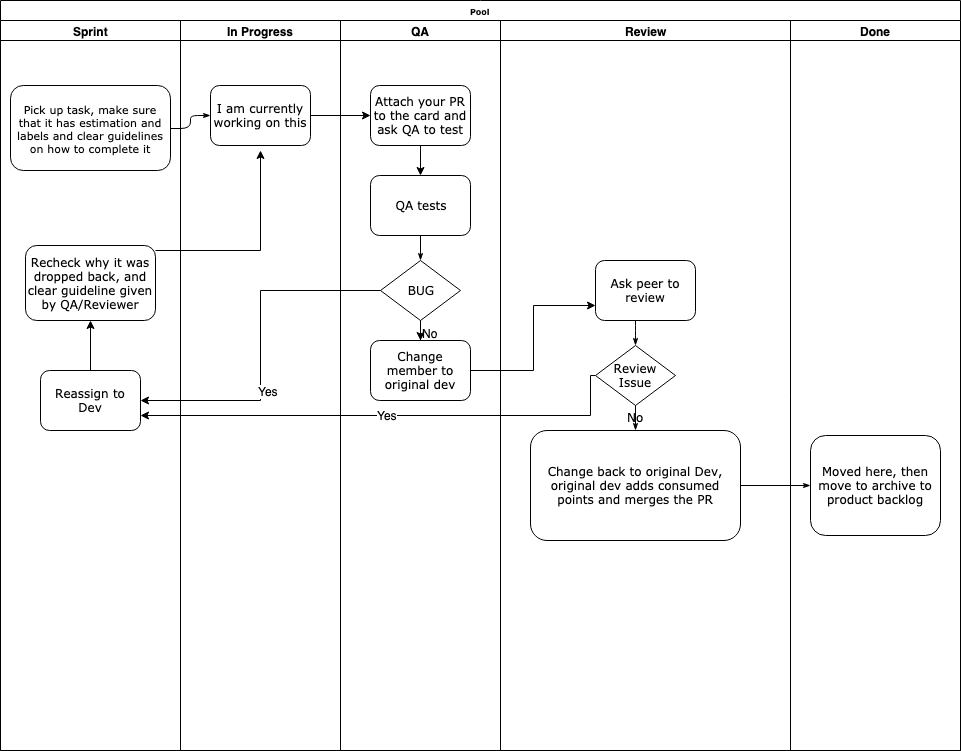

#Operational Process - traceto.io Dev
##Working Flow

We are following git flow currently, although we may change that soon.

Our general flow is represented by:



- Create a Task
- Once task in progress move to in progress.

```For Git branching follow https://danielkummer.github.io/git-flow-cheatsheet/```

- Follow the diagram on how to move tasks across the trello board;
- Our current sprint board is [here] (https://trello.com/b/rWIyiu62/tracetoio-dapp);
- Every Merge to develop requires atleast 1 approval. That means 1 peer review;

##Release Flow

###UAT 
Once in UAT, respective leads, to see what are bugs and what are not and condense to a single card. 
Subsequently, move this card to the Sprint Board as a Bugfix card. 

We try to release at the end of every sprint.
As a practice we try to release to UAT on Monday/Tuesday and do a production release by Thursday

###Bugfixes
For Git Flow, when there is a bugfix card, pull from the latest release branch and create a new bugfix branch. 
Solve and PR back to release branch

Once all bugfixes are cleared, add a release tag with rc-v<> and then push the tag which would move the changes to beta environment.

Once production ready, we will use tag like v1.0.1 and this will push to production.

##Hotfixes - Production Bugs

For hotfix do the following 

- git pull master and develop branches
- git flow hotfix start v1.0.1 for eg. (use regular version numbers) 
- git flow hotfix publish( in case other people have to contribute to this hotfix or peer review)
- git flow hotfix finish
- git push – all
- git push –tags

##Deployment
- The tags/branches once pushed, in jenkins/codedeploy it auto deploys to the environment;
- Please note for frontend and backend that for production releases there is a manual check currently;
- We will be removing this soon as well;

##References
1. https://github.com/petervanderdoes/gitflow-avh
